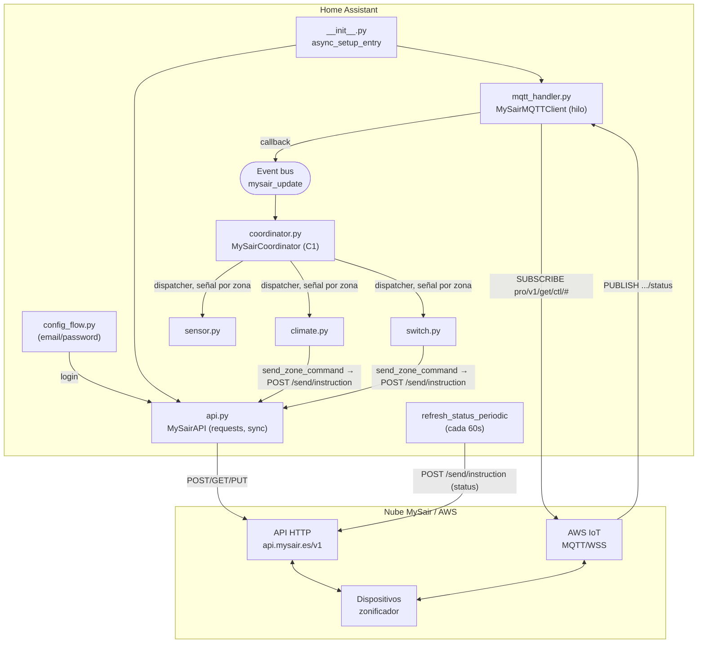
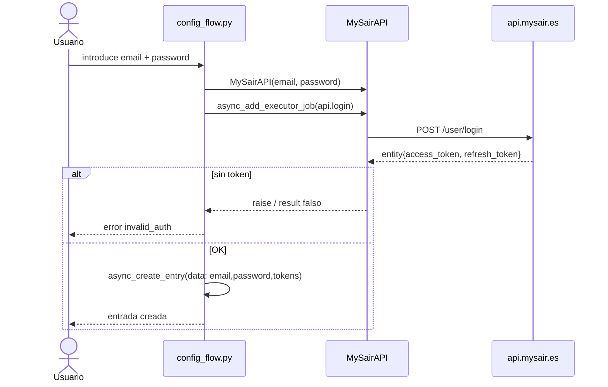
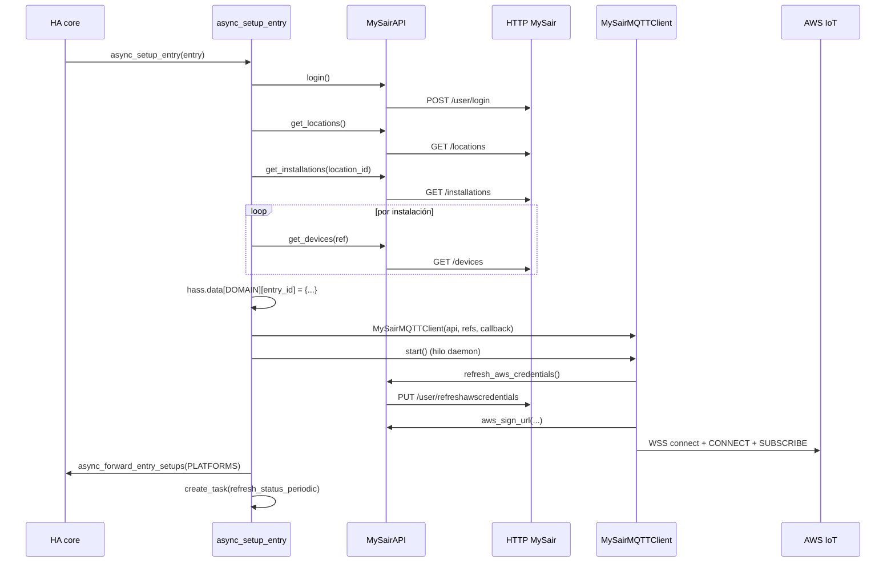
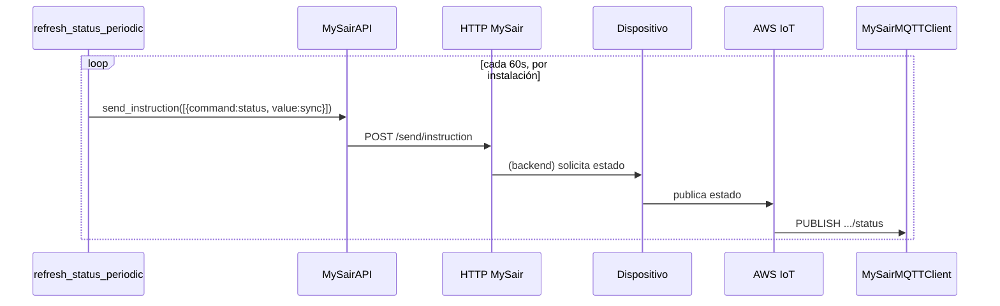
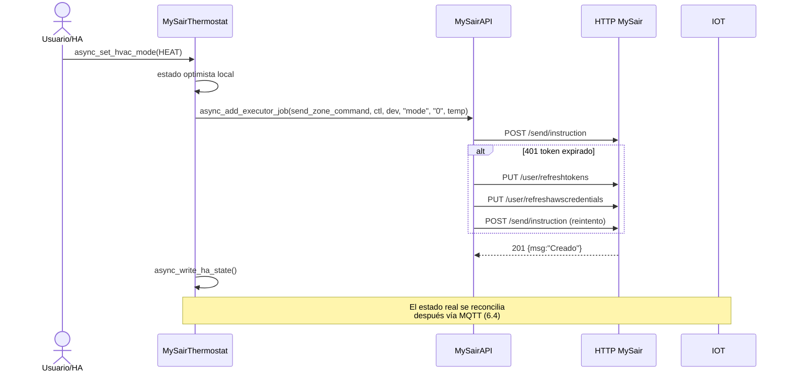
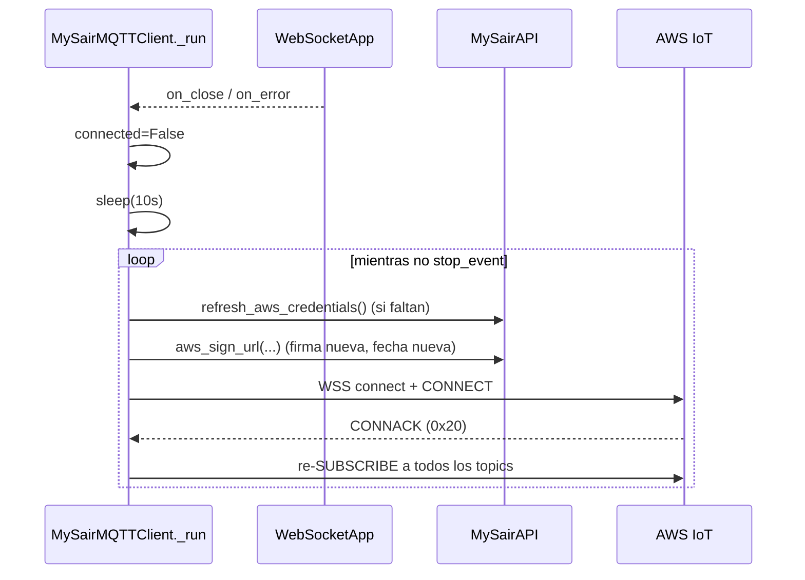

# Arquitectura — Integración MySair para Home Assistant

> Convención de certeza usada en todo el documento:
> **Confirmado** (leído en el código) · **Inferido** (deducido del flujo) · **Hipótesis** (razonable pero sin evidencia directa) · **Desconocido** (requiere dispositivo real).

---

## 1. Resumen del sistema

MySair es un sistema de **zonificación de climatización** (aire acondicionado y/o suelo radiante, combinables por zona — ver `m` en `docs/protocol-findings.md` §4) controlado desde la nube. Esta integración (custom component, dominio `mysair`) permite a Home Assistant:

- Autenticarse contra la API HTTP de MySair (`https://api.mysair.es/v1`). **Confirmado** — `api.py:18`.
- Descubrir la topología: *ubicaciones → instalaciones → dispositivos (termostatos/zonas)*. **Confirmado** — `__init__.py:34-55`.
- Recibir estado en tiempo real por **MQTT sobre WebSocket** contra AWS IoT. **Confirmado** — `mqtt_handler.py`.
- Enviar comandos (encender/apagar, temperatura, modo) vía HTTP `POST /send/instruction`. **Confirmado** — `api.py:192-230`.

`iot_class` declarado: `cloud_push` (`manifest.json:10`). **Confirmado**, aunque en la práctica es *cloud_push híbrido con polling*: el estado se **recibe** por MQTT (push) pero se **provoca** con un `POST` HTTP cada 60 s (`__init__.py:151-171`).

### Hecho arquitectónico clave (Confirmado)
Los **comandos NO se publican por MQTT**. El cliente MQTT solo hace `CONNECT` + `SUBSCRIBE`; nunca `PUBLISH` (`mqtt_handler.py` no construye ningún paquete PUBLISH). Todo comando sale por HTTP a `/send/instruction`, y el backend de MySair es quien reenvía a los dispositivos y devuelve el estado por MQTT. La conexión MQTT es **solo de recepción**.

---

## 2. Estructura del repositorio

```
homeassistant-mysair/
├── custom_components/mysair/     # Paquete de la integración (layout estándar HA/HACS)
│   ├── __init__.py               # Setup/unload, callback MQTT, refresco periódico
│   ├── api.py                    # MySairAPI: HTTP síncrono (requests) + firma AWS SigV4
│   ├── status_parser.py          # Parser puro del payload 'status' (sin dependencia de HA)
│   ├── mqtt_handler.py           # MySairMQTTClient: MQTT crudo sobre WebSocket
│   ├── climate.py                # MySairThermostat (ClimateEntity)
│   ├── sensor.py                 # 3 sensores por zona (temp actual, consigna, modo)
│   ├── switch.py                 # MySairSwitch (power on/off por zona)
│   ├── config_flow.py            # Config flow (email + password)
│   ├── const.py                  # Constantes (algunas sin uso)
│   └── manifest.json             # Manifiesto de la integración
│   # (select.py eliminado en estabilización — era código muerto/roto)
├── tests/                        # Tests P0/P1 (no requieren HA) + fixtures sanitizadas
├── docs/                         # (esta documentación)
├── pytest.ini · requirements-test.txt
└── README.md · CLAUDE.md
```

Nota (fase de estabilización): la integración se movió a `custom_components/mysair/`
(layout estándar, habilita HACS y permite ejecutar los tests con `pytest`). Se añadió
`tests/`; siguen sin existir `translations/`, `hacs.json`, `diagnostics.py` ni CI.

---

## 3. Componentes y responsabilidades

| Componente | Archivo | Responsabilidad | Hilo/loop |
|---|---|---|---|
| `async_setup_entry` | `__init__.py:17` | Orquesta login → descubrimiento → MQTT → plataformas → refresco | event loop + executor |
| `mqtt_message_callback` | `__init__.py:67` | Parsea `status`, normaliza zonas, dispara evento `mysair_update` | hilo MQTT → `call_soon_threadsafe` |
| `refresh_status_periodic` | `__init__.py:151` | Cada 60 s pide `status`/`sync` a cada instalación por HTTP | event loop task |
| `MySairAPI` | `api.py:12` | Login, refresh tokens, credenciales AWS, descubrimiento, instrucciones, firma SigV4 | executor (bloqueante) |
| `MySairMQTTClient` | `mqtt_handler.py:69` | Conexión WSS, CONNECT/SUBSCRIBE manuales, reconexión | hilo daemon propio |
| `MySairCoordinator` | `coordinator.py` | Escucha `mysair_update` **una sola vez** por config entry, filtra por instalación propia y redistribuye cada zona por separado vía `homeassistant.helpers.dispatcher` (C1) | event loop |
| Entidades | `climate/sensor/switch.py` | Se suscriben a la señal de dispatcher de su propia zona (`coordinator.signal_zone_update`), ya sin filtrar `ctl`/`zone_id`; actualizan estado | event loop |

### Dependencias entre módulos (Confirmado)

```
config_flow.py ─► api.py (login)
__init__.py ─► api.py, mqtt_handler.py, const.py
mqtt_handler.py ─► api.py (aws_credentials, aws_sign_url)
climate/sensor/switch.py ─► const.py (DOMAIN)  y  hass.data[DOMAIN][entry_id]["api"]
```

Las entidades **no** conocen `MySairMQTTClient` directamente: se comunican con él a través del **event bus** de HA (`mysair_update`), pero ya no escuchan ese evento cada una por su cuenta — `MySairCoordinator` (C1) es el único suscriptor del bus por config entry, y redistribuye cada zona por separado a la entidad correspondiente vía `homeassistant.helpers.dispatcher`. Acoplamiento por evento + dispatcher. **Confirmado**.

---

## 4. Origen de los datos: HTTP vs MQTT

| Dato | Origen | Evidencia |
|---|---|---|
| Tokens de sesión | HTTP `POST /user/login` | `api.py:32-44` |
| Credenciales AWS IoT | HTTP `PUT /user/refreshawscredentials` | `api.py:94-131` |
| Ubicaciones / instalaciones / dispositivos (topología) | HTTP `GET /locations`, `/installations`, `/devices` | `api.py:140-187` |
| Estado de zonas (temp actual, consigna, min/max, modo) | **MQTT** topic `.../status` | `__init__.py:95-108` |
| Comandos (temp, mode, power) | HTTP `POST /send/instruction` | `api.py:192-230` |
| Provocación de refresco de estado | HTTP `POST /send/instruction` (`command:status`) | `__init__.py:156-164` |

**Inferido:** la topología (nombres de zona) se obtiene *solo una vez* al arranque (HTTP); los valores dinámicos llegan *solo* por MQTT. Si MQTT nunca conecta, las entidades permanecen con valores iniciales (`None` / `22.0` / `OFF`).

---

## 5. Diagrama de alto nivel



---

## 6. Diagramas de secuencia

### 6.1 Configuración inicial (config flow)



> **Bug (Confirmado):** el config flow guarda `password` en claro y `access_token`/`refresh_token` que **nunca se reutilizan** (en el arranque se hace login nuevo). Ver `docs/security-and-privacy.md`.

### 6.2 Arranque de Home Assistant (setup entry)



### 6.3 Lectura de estado (refresco provocado)



### 6.4 Actualización recibida por MQTT

```mermaid
sequenceDiagram
    participant IOT as AWS IoT
    participant M as MySairMQTTClient._on_message
    participant CB as mqtt_message_callback
    participant BUS as event bus
    participant CO as MySairCoordinator
    participant E as Entidad (climate/sensor/switch)
    IOT->>M: frame WSS binario (PUBLISH 0x30)
    M->>M: extrae topic + JSON del payload
    M->>CB: callback({topic, payload})
    CB->>CB: limpia ';' final, json.loads, parsea t[]
    CB->>BUS: call_soon_threadsafe(async_fire, mysair_update, {topic,data})
    BUS->>CO: _handle_update(event) (único suscriptor, C1)
    CO->>CO: filtra ctl en installation_refs, indexa por zona
    CO->>E: async_dispatcher_send(signal_zone_update(ctl, zone_id), zone)
    E->>E: _handle_zone_update(zone): actualiza estado + async_write_ha_state()
```

### 6.5 Envío de comando desde una entidad



### 6.6 Recuperación tras desconexión MQTT



> **Nota (Confirmado):** en la reconexión, `_run` **no** vuelve a solicitar credenciales AWS salvo que `self.api.aws_credentials` sea falsy (`mqtt_handler.py:110`). Como una vez obtenidas ya no son `None`, se **reutiliza la firma con credenciales potencialmente caducadas** hasta que la firma falle. Ver `docs/quality` en `security-and-privacy.md` y hallazgos.

---

## 7. Decisiones técnicas observadas

| Decisión | Evidencia | Comentario |
|---|---|---|
| Cliente HTTP **síncrono** (`requests`) ejecutado en executor | `api.py:1`, `__init__.py:31` | Evita bloquear el loop, pero contradice `aiohttp` del manifest (no se usa). |
| MQTT **artesanal** sobre WebSocket en vez de `paho`/`amqtt` | `mqtt_handler.py:37-63` | Construye paquetes MQTT a mano; `paho-mqtt` del manifest no se usa. |
| Comunicación entidad↔datos vía **event bus** | `climate.py:71`, `__init__.py:116` | Desacopla, pero es fan-out O(nº entidades) por mensaje. |
| Estado **optimista** en comandos | `climate.py:101`, `switch.py:67` | Se reconcilia luego por MQTT; sin rollback si el comando falla. |
| Sin `DataUpdateCoordinator` | — | Patrón push manual; ver `docs/home-assistant-integration.md`. |
| Firma AWS SigV4 propia | `api.py:288-329` | `boto3` del manifest no se usa. |

---

## 8. Puntos pendientes de confirmar (resumen)

- Estructura exacta de las respuestas HTTP (campos de `location`, `installation`, `device`). **Desconocido** — solo se consumen `id`, `reference`, `name`. Ver `docs/mysair-http-api.md`.
- Semántica completa del payload MQTT `status` (campos `t[]`: `rf,n,tr,tc,tmm,tmx,e`, y otros no leídos). **Inferido parcialmente**. Ver `docs/mysair-mqtt-protocol.md`.
- Codificación de modo **inconsistente** entre comando (`0=calor,1=frío`) y estado (`e: 1=heat,2=cool`). **Confirmado como inconsistencia**, semántica real **Desconocida**. Ver `docs/known-unknowns.md`.
- Si el backend admite realmente `command:"temp"` con `value` string, o requiere el dict como en `mode`. **Hipótesis**.
- Formato de topics de publicación de estado más allá de `.../status`. **Desconocido**.

Referencias cruzadas: `docs/mysair-http-api.md`, `docs/mysair-mqtt-protocol.md`, `docs/domain-model.md`, `docs/home-assistant-integration.md`, `docs/testing-strategy.md`, `docs/security-and-privacy.md`, `docs/known-unknowns.md`, `docs/development-roadmap.md`.
