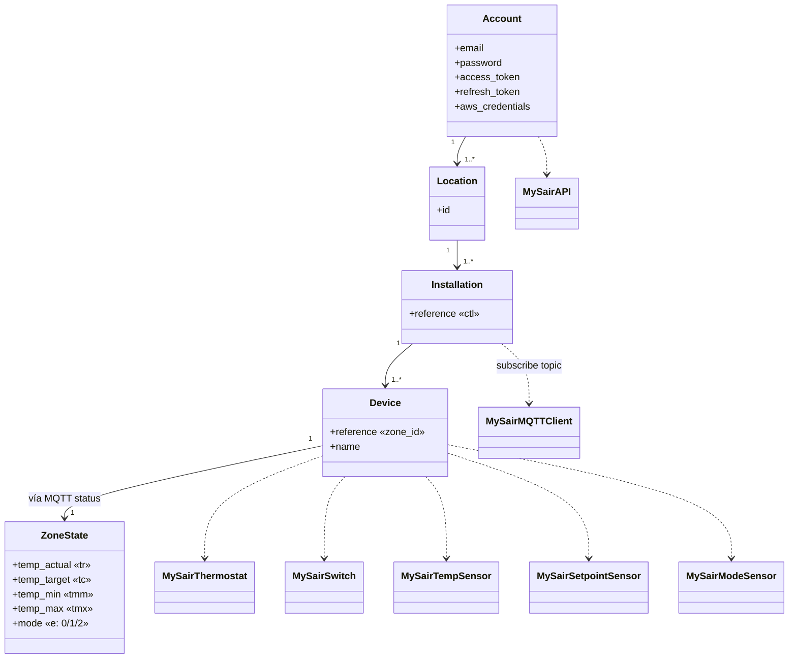

# Modelo de dominio de MySair

> Reconstrucción conceptual a partir del código. Certeza marcada por elemento.

---

## 1. Jerarquía de conceptos (Confirmado por el flujo de descubrimiento)

```
Cuenta (email/password)
  └── Location (ubicación)            GET /locations            → id
        └── Installation (sistema)   GET /installations        → reference  (== ctl == controlador)
              └── Device (zona/termostato)  GET /devices        → reference, name
                    └── Estado (por MQTT)   .../status → t[]    → tr,tc,tmm,tmx,e
```

**Observaciones (Confirmado):**
- La integración usa **solo la primera `Location`** (`__init__.py:39`).
- **Todas** las instalaciones de esa ubicación se cargan (`__init__.py:50-55`).
- El `Installation.reference` cumple triple rol: `ctl` en comandos, prefijo de topic MQTT, e identificador de "instalación".
- Un `Device` = una **zona** = un **termostato** en la terminología del código (se usan indistintamente).

---

## 2. Diagrama de clases (conceptual + implementación)



---

## 3. Modelos internos

| Modelo | ¿Clase formal? | Representación real | Origen |
|---|---|---|---|
| Account | No | atributos de `MySairAPI` (`email`, `password`, `access_token`, `refresh_token_value`, `aws_credentials`, `entity`) | `api.py:15-23` |
| Location | No | `dict` con `id`, guardado transitoriamente | `__init__.py:39` |
| Installation | No | `str` (`reference`) en lista `installation_refs` | `__init__.py:49-52` |
| Device | No | `dict` en `all_devices[ref]`, se lee `reference`/`name` | `__init__.py:53-54` |
| ZoneState | No | `dict` normalizado emitido en el evento `mysair_update` | `__init__.py:99-108` |

> **No existen dataclasses ni modelos tipados.** Todo son `dict`/`str`/`list`. **Confirmado.** Esto es deuda técnica (ver `docs/testing-strategy.md` y roadmap).

---

## 4. Mapeo MySair → entidades Home Assistant

| Concepto MySair | Entidad HA | unique_id | Plataforma | Certeza |
|---|---|---|---|---|
| Device (zona) | `climate.MySairThermostat` | `mysair_{ctl}_{dev}` | climate | Confirmado |
| Device — temp actual | `sensor.MySairTempSensor` | `mysair_temp_{ctl}_{dev}` | sensor | Confirmado |
| Device — consigna | `sensor.MySairSetpointSensor` | `mysair_setpoint_{ctl}_{dev}` | sensor | Confirmado |
| Device — modo | `sensor.MySairModeSensor` | `mysair_mode_{ctl}_{dev}` | sensor | Confirmado |
| Device — power | `switch.MySairSwitch` | `mysair_switch_{ctl}_{dev}` | switch | Confirmado |
| Device — modo frío/calor | ~~`select.MySairModeSelect`~~ | — | **eliminada** en estabilización (era código muerto/roto) | — |

**Device registry:** todas las entidades comparten `identifiers = {(DOMAIN, f"{ctl}_{dev}")}` → una zona = **un device HA** con climate+switch+3 sensores. **Confirmado** (`climate.py:62`, etc.). `select.py` añade además `via_device=(DOMAIN, ctl)` a un device que **nunca se crea** → referencia colgante. **Confirmado**.

---

## 5. Representación de atributos dinámicos

| Atributo dominio | Campo MQTT | Entidad/propiedad HA | Mapeo modo |
|---|---|---|---|
| Temperatura actual | `tr` | `climate.current_temperature`, `MySairTempSensor` | — |
| Consigna | `tc` | `climate.target_temperature`, `MySairSetpointSensor` | — |
| Rango temp | `tmm`/`tmx` | (parseados pero **no** aplicados; climate usa 10–30 fijos) | — |
| Modo/estado | `e` | `climate.hvac_mode/hvac_action`, `MySairModeSensor`, `switch.is_on` | `0→OFF/IDLE`, `1→HEAT/HEATING`, `2→COOL/COOLING` |

> **Confirmado:** `tmm`/`tmx` se parsean (`__init__.py:105-106`) pero **no** se usan para fijar `min_temp`/`max_temp` de la entidad climate (que están fijos a 10/30 en `climate.py:43-44`). Campos leídos-e-ignorados.

---

## 6. Conceptos ausentes o no modelados

| Concepto | Estado | Nota |
|---|---|---|
| Velocidad del ventilador | **Desconocido** | No aparece en el código. |
| Apertura de compuerta (damper) | **Desconocido** | No modelado; podría estar en campos MQTT no leídos. |
| Modo `auto` | Parcial | `const.HVAC_MODES` incluye `auto` pero climate no lo soporta. Inconsistente. |
| Online/offline por zona | **Desconocido** | No hay `available` real; las entidades no reportan disponibilidad. |
| Errores del dispositivo | **Desconocido** | No modelados. |
| Escenas / programación horaria | **Desconocido** | No aparecen. |
| Controlador como device | No modelado | `via_device` apunta a un device inexistente. |

---

## 7. Campos cuyo significado NO está confirmado

| Campo | Contexto | Interpretación asumida | Certeza |
|---|---|---|---|
| `e` (status) | `t[]` | 0=off, 1=heat, 2=cool | Inferido (mapeo del código), semántica real Desconocida |
| `m` (status) | `select.py` | 1=calor, else frío | Hipótesis, contradice `e` |
| `tmm`/`tmx` | `t[]` | min/max temp | Inferido |
| `tr` vs `tc` | `t[]` | actual vs consigna | Inferido (por nombres de variable) |
| `value` string con `;` final | status | JSON serializado con terminador | Confirmado el tratamiento, no el porqué |
| `app` (`web0077`/`aws_mqtt_user`) | instrucción | identificador de cliente emisor | Inferido |
| `validated=1` | query installations | filtro de instalaciones validadas | Inferido |
| Campos de `device`/`location`/`installation` distintos de los leídos | HTTP | — | Desconocido |

Ver `docs/known-unknowns.md` para el plan de validación de cada uno.
