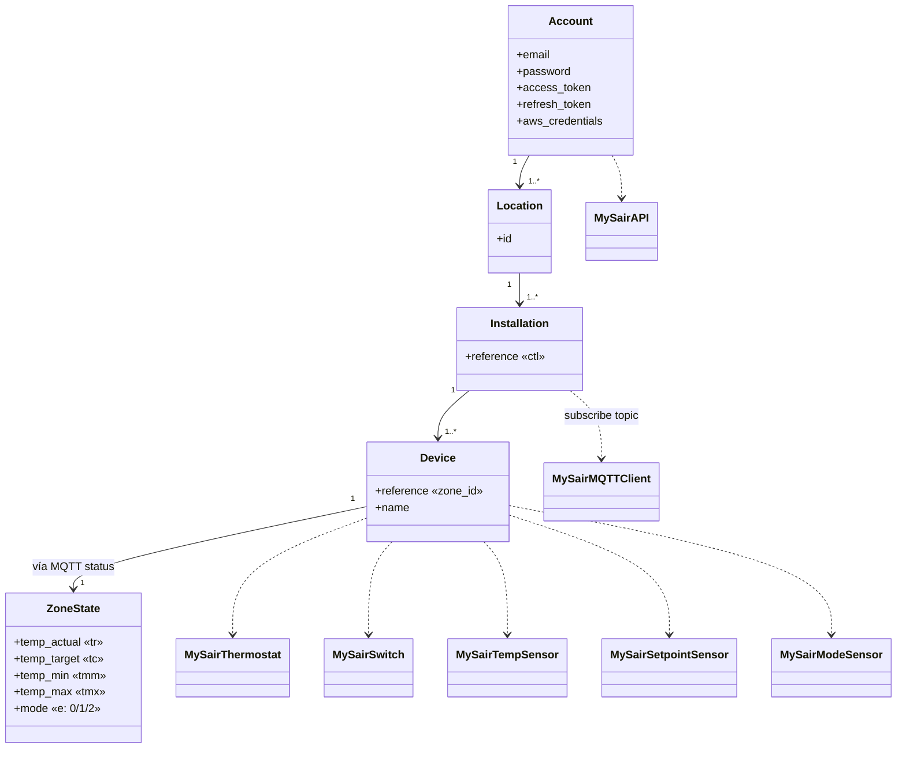

# Modelo de dominio de MySair

> Reconstrucción conceptual a partir del código. Certeza marcada por elemento.

---

## 1. Jerarquía de conceptos (Confirmado por el flujo de descubrimiento)

```
Cuenta (email/password)
  └── Location (ubicación)            GET /locations            → id
        └── Installation (sistema)   GET /installations        → reference  (== ctl == controlador)
              └── Device (zona/termostato)  GET /devices        → reference, name
                    └── Estado (por MQTT)   .../status → t[]    → tr,tc,tmm,tmx,e
```

**Observaciones (Confirmado):**
- La integración usa **solo la primera `Location`** (`__init__.py:39`).
- **Todas** las instalaciones de esa ubicación se cargan (`__init__.py:50-55`).
- El `Installation.reference` cumple triple rol: `ctl` en comandos, prefijo de topic MQTT, e identificador de "instalación".
- Un `Device` = una **zona** = un **termostato** en la terminología del código (se usan indistintamente).

---

## 2. Diagrama de clases (conceptual + implementación)



---

## 3. Modelos internos

| Modelo | ¿Clase formal? | Representación real | Origen |
|---|---|---|---|
| Account | No | atributos de `MySairAPI` (`email`, `password`, `access_token`, `refresh_token_value`, `aws_credentials`, `entity`) | `api.py:15-23` |
| Location | No | `dict` con `id`, guardado transitoriamente | `__init__.py:39` |
| Installation | No | `str` (`reference`) en lista `installation_refs` | `__init__.py:49-52` |
| Device | No | `dict` en `all_devices[ref]`, se lee `reference`/`name` | `__init__.py:53-54` |
| ZoneState | No | `dict` normalizado emitido en el evento `mysair_update` | `__init__.py:99-108` |

> **No existen dataclasses ni modelos tipados.** Todo son `dict`/`str`/`list`. **Confirmado.** Esto es deuda técnica (ver `docs/testing-strategy.md` y roadmap).

---

## 4. Mapeo MySair → entidades Home Assistant

| Concepto MySair | Entidad HA | unique_id | Plataforma | Certeza |
|---|---|---|---|---|
| Device (zona) | `climate.MySairThermostat` | `mysair_{ctl}_{dev}` | climate | Confirmado |
| Device — temp actual | `sensor.MySairTempSensor` | `mysair_temp_{ctl}_{dev}` | sensor | Confirmado |
| Device — consigna | `sensor.MySairSetpointSensor` | `mysair_setpoint_{ctl}_{dev}` | sensor | Confirmado |
| Device — modo | `sensor.MySairModeSensor` | `mysair_mode_{ctl}_{dev}` | sensor | Confirmado |
| Device — power | `switch.MySairSwitch` | `mysair_switch_{ctl}_{dev}` | switch | Confirmado |
| Device — modo frío/calor | ~~`select.MySairModeSelect`~~ | — | **eliminada** en estabilización (era código muerto/roto) | — |

**Device registry:** todas las entidades comparten `identifiers = {(DOMAIN, f"{ctl}_{dev}")}` → una zona = **un device HA** con climate+switch+3 sensores. **Confirmado** (`climate.py:62`, etc.). `select.py` añade además `via_device=(DOMAIN, ctl)` a un device que **nunca se crea** → referencia colgante. **Confirmado**.

---

## 5. Representación de atributos dinámicos

| Atributo dominio | Campo MQTT | Entidad/propiedad HA | Mapeo |
|---|---|---|---|
| Temperatura actual | `tr` | `climate.current_temperature`, `MySairTempSensor` | — |
| Consigna | `tc` | `climate.target_temperature`, `MySairSetpointSensor` | — |
| Rango temp | `tmm`/`tmx` | (parseados pero **no** aplicados; climate usa 10–30 fijos) | — |
| Encendido | `e` | `climate.hvac_mode==OFF`, `switch.is_on`, `MySairModeSensor` | `"0"→off`, `"1"→on`, `"2"→standby (IDLE)` |
| Calor/frío | `m` (paridad) | `climate.hvac_mode/action`, `MySairModeSensor` | par→HEAT/HEATING, impar→COOL/COOLING |
| Humedad | `hm` | (parseada, aún sin entidad) | — |
| Capacidades | `c`/`f`/`v`/`s` | (parseadas, aún sin uso) | permite calor/frío/fan/suelo |

> ✅ **Corregido (A5):** `e` es el **encendido** (no el modo) y el modo real es `m`. `status_parser.parse_status_payload` deriva `is_on`/`is_standby` de `e` y `is_heat`/`is_cool`/`is_ac`/`is_floor` de `m`. Ver `docs/protocol-findings.md`.
> **Pendiente:** `tmm`/`tmx` se parsean pero **no** fijan `min_temp`/`max_temp` de climate (fijos 10/30 en `climate.py`). `hm` y capacidades se parsean pero aún no tienen entidad (oportunidad).

---

## 6. Conceptos ahora modelables (confirmados en el protocolo, aún sin entidad)

| Concepto | Campo | Estado en la integración |
|---|---|---|
| Suelo radiante vs AC | `m` ({2,3,4,5}=suelo) + capacidad `s` + `sv` (encendido/apagado) | ✅ **Implementado (F4, 2026-07-21):** `switch.py` → `MySairFloorSwitch`, reutiliza el comando `mode` recalculando `m` (`compute_mode_value`). Resumen de qué medio está activo (`ac`/`suelo`/`mixto`, se conserva apagado) expuesto como atributo `medio` de `sensor.<zona>_modo` (2026-07-21). |
| Velocidad del ventilador | `vv` + capacidad `v` + comando `fanspeed` | ✅ Implementado (F2) |
| Humedad | `hum` (fallback `hm`) | ✅ Implementado (F1) |
| Standby | `e=="2"` | ✅ Mapeado a `HVACAction.IDLE` |

## 6b. Conceptos aún ausentes o no confirmados

| Concepto | Estado | Nota |
|---|---|---|
| Modo `auto` | 🟢 **Evaluado (F3, 2026-07-21) — sin soporte de protocolo:** `m` (0-5) cubre exactamente las 6 combinaciones AC/suelo × calor/frío, sin hueco para un modo de cambio automático. `const.HVAC_MODES` (con `"auto"`) era código muerto sin ningún consumidor; eliminado. El único "auto" real del protocolo es la velocidad de ventilador (`vv="4"`, ya implementado en F2). |
| Temporizador / Programas | 🟢 **Descartado por decisión de alcance (F6, 2026-07-21):** solo el nombre de los comandos (`temporizer`, `programs`) está confirmado en el bundle; la forma del payload para *fijar* un temporizador o programa nunca se decodificó, y no existe ni un `setPrograms` de escritura. Implementarlo exigiría inventar campos. Ver `known-unknowns.md` #27. |
| Online/offline por zona | **Desconocido** | Sin `available`; existe `isOutService` en la app (sin confirmar campo). |
| Errores del dispositivo | **Desconocido** | No modelados. |
| Controlador como device | No modelado | `via_device` apuntaba a un device inexistente (select.py eliminado). |

---

## 7. Campos: estado de confirmación

| Campo | Significado | Certeza |
|---|---|---|
| `e` (status) | encendido: 0=off, 1=on, 2=standby | ✅ Confirmado (app oficial) |
| `m` (status) | modo 0-5: par=calor, impar=frío; {0,1,4,5}=AC, {2,3,4,5}=suelo | ✅ Confirmado |
| `tr`/`tc`/`tmm`/`tmx`/`hm` | temp actual/consigna/min/max/humedad | ✅ Confirmado |
| `vv`/`tzv` | fan / temporizador (valores actuales) | ✅ Confirmado |
| `sv` | suelo radiante encendido/apagado ("0"/"1") | ✅ Confirmado (re-verificado 2026-07-21, ver `known-unknowns.md` #26) |
| `c`/`f`/`v`/`s`/`tz`/`hp`/`pl` | capacidades (calor/frío/fan/suelo/timer/programas/principal) | ✅ Confirmado |
| `value` string con `;` final | JSON serializado con terminador (`slice(0,-1)` en la app) | ✅ Confirmado |
| `app` (`web0077`/`aws_mqtt_user`) | `session.getClientId()` del emisor | ✅ Confirmado |
| `validated=1` | filtro de instalaciones validadas | Inferido |
| Campos de `location`/`installation` distintos de los leídos | — | Desconocido |

Ver `docs/protocol-findings.md` (fuente) y `docs/known-unknowns.md` (incógnitas restantes).
